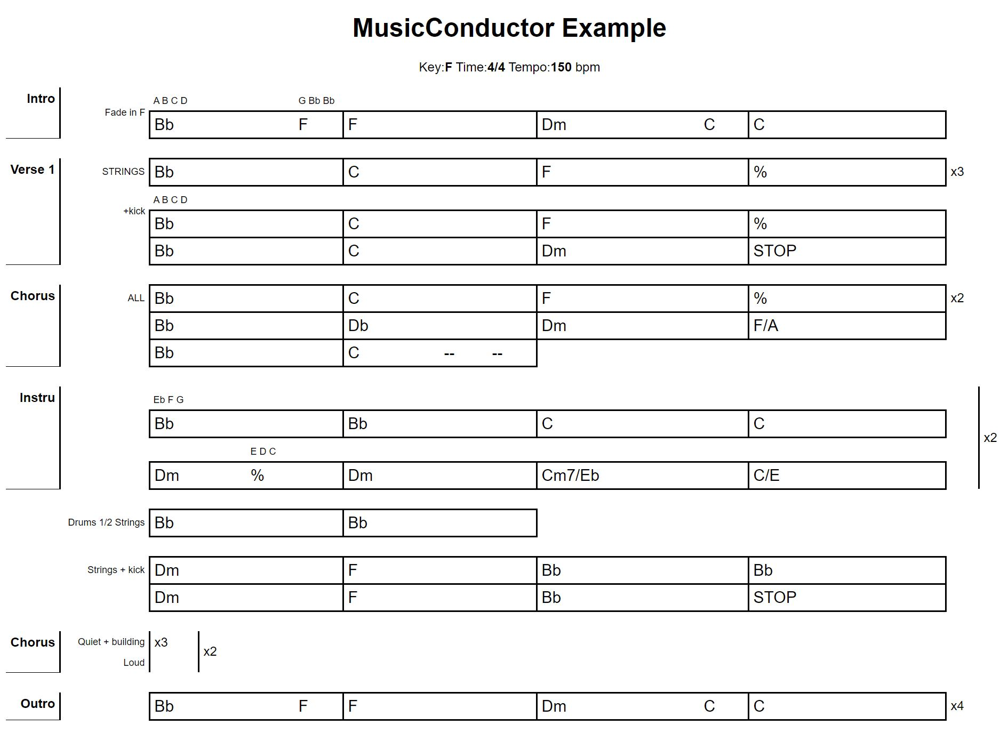

# MusicConductor
## goal
*MusicConductor* aims at rendering pretty chords conductors using a light language.
It also enables an easy way to transpose.
## Expected behavior
Here is an example of the expected result:


Which is the result of the following document:
```
MusicConductor Example; F; 4/4; 150
_"Intro";
"Fade in F" ; 3Bb[A B C D] 1F[G Bb A#]|F|3Dm 1C|C 

_"Verse 1";
"STRINGS" ; Bb|C|F|% ; *3
"+kick"; Bb[A B C D]|C|F|%
Bb|C|Dm|STOP

_"Chorus"
"ALL"; Bb|C|F|%;*2
Bb|C#|Dm|F/A
Bb|2C 1-- 1--||

_"Instru";*2
Bb[Eb F G]|Bb|C|C
2Dm 2%[E D C]|Dm|Cm7/Eb|C/E

_""
"Drums 1/2 Strings"; Bb|Bb||

_""
"Strings + kick"; Dm|F|Bb|Bb
Dm|F|Bb|STOP

_"Chorus"; *2
"Quiet + building";*3
"Loud"

_"Outro";
3Bb 1F|F|3Dm 1C|C;*4
```
@@include[languagedefinition.md](./docs/languagedefinition.md)