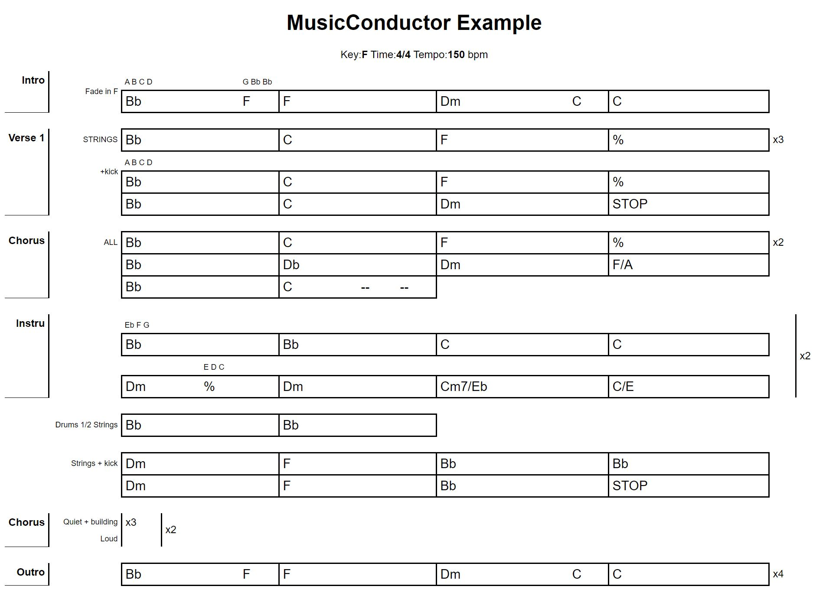

# MusicConductor
## goal
*MusicConductor* aims at rendering pretty chords conductors using a light language.
It also enables an easy way to transpose.
## Expected behavior
Here is an example of the expected result:


Which is the result of the following document:
```
MusicConductor Example; F; 4/4; 150
_"Intro";
"Fade in F" ; 3Bb 1F|F|3Dm 1C|C 

_"Verse 1"; 
"STRINGS" ; Bb|C|F|% ; *3
"+kick"; Bb|C|F|%
Bb|C|Dm|STOP

_"Chorus"
"ALL"; Bb|C|F|%;*2
Bb|C|Dm|F/A
Bb|2C 1-- 1--||

_"Intro"
"Strings Bass kick"; Bb|F|2Dm 1-- 1--|1-- 1-- 1-- 1--

_"Verse 2"
"Strings Bass kick"; Bb|C|F|%;*3
Bb|C|Dm|F/A
Bb|C||

_"Instru";*2
Bb|Bb|C|C
Dm|Dm|C/E|C/E

_""
"Drums 1/2 Strings"; Bb|Bb||

_""
"Strings + kick"; Dm|F|Bb|Bb
Dm|F|Bb|STOP

_"Chorus"; *2
"tranquille";*3
"violent"

_"Outro";
3Bb 1F|F|3Dm 1C|C;*4
```
# Language definition
A song is structured as followed:
## First line
Ordered information seperated with `;`
  1. ***title***
  2. ***original key*** (e.g. `F`, `Bb`, `F#`)
  3. ***time*** (e.g. `4/4`)
  4. ***tempo*** (e.g. 150)
  5. (optional, default value = 4) the ***bar resolution*** : ie the number of part a bar is divided in.
  
  example:
  ```
  MusicConductor Example; F; 4/4; 150
  ```

## Section
Starts with the character `_` followed by (separated with *line breaks*)
1. separated with commas `;`
  * ***section title*** between `" "`
  * (optional, default = 1) `*` number of ***repetitions*** for the section

example:

```
_"Instru";*2
```

2. ***Barlines*** made of (in any order):
  * ***Bars*** separated with `|` containing 
    * ***Music items*** (see below) separated with space
  * (optional, default = 1) `*` number of ***repetions*** for the line
  * (optional) ***comment*** between `" "`
    
example:

```
"STRINGS" ; Bb|3C7 1Gb7|F|% ; *3
```

## Music item
A Music item is composed of:
* (optional, default value = *bar resolution* (see above)) ***duration*** expressed in one digit [1-9]. When no duration is expressed, this means the music item will cover the whole bar. If not, it's its spanning portion out of the *bar resolution* of the song. The sum of each duration of a bar shall be equal to *bar resolution*
*  a music element that can be:
    * any string (not including separators such as `|`, `;`, `"` or ` `)
    * a ***chord*** following the pattern `Key`, `KeyChordtype` or `KeyChordtype\BassKey`

Note that a key may be changed from one key map to another (e.g. `Db` to `C#`) to ensure overall consistency with the declared *original key* of the song.

examples:
```
2STOP
%
F#
2F/G
FM7/A
Bb7b9/D
```

# Run
## Render
The song is embedded in a string `song_str`
To generate the corresponding `html` file
```
sf = SongFactory()
song = sf.parse(song_str)
with open(h_tml_file_name,"w") as f:
    f.write(song.with_yattag())
```
Add `style.css` found in `./source/`in the repository of the generated file
## Transpose
Based on the previous example, one can change the key with `song.set_key()`. (The originate key of the song is the one declared in the first line of the document)
```
sf = SongFactory()
song = sf.parse(song_str)
song.set_key('F#')
with open(h_tml_file_name,"w") as f:
    f.write(song.with_yattag())
```
